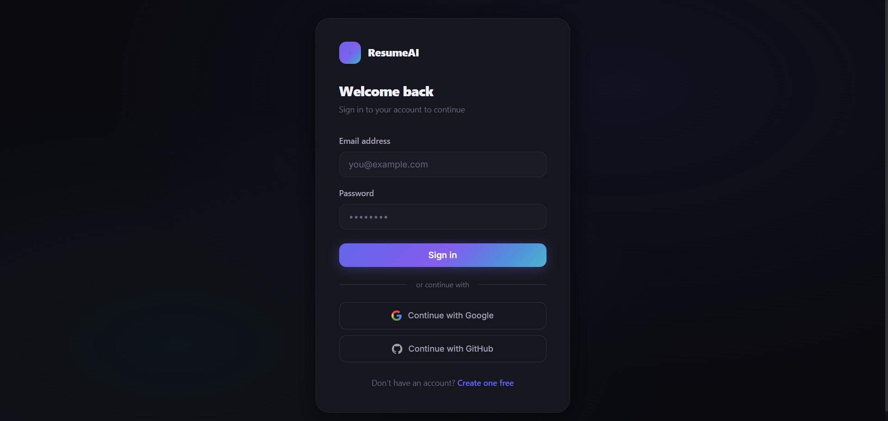
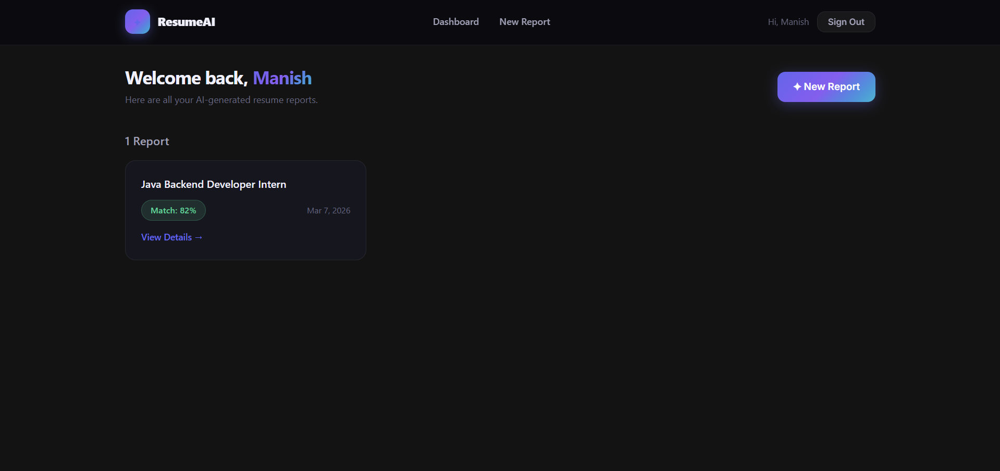
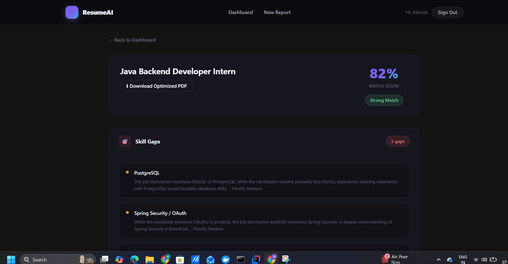
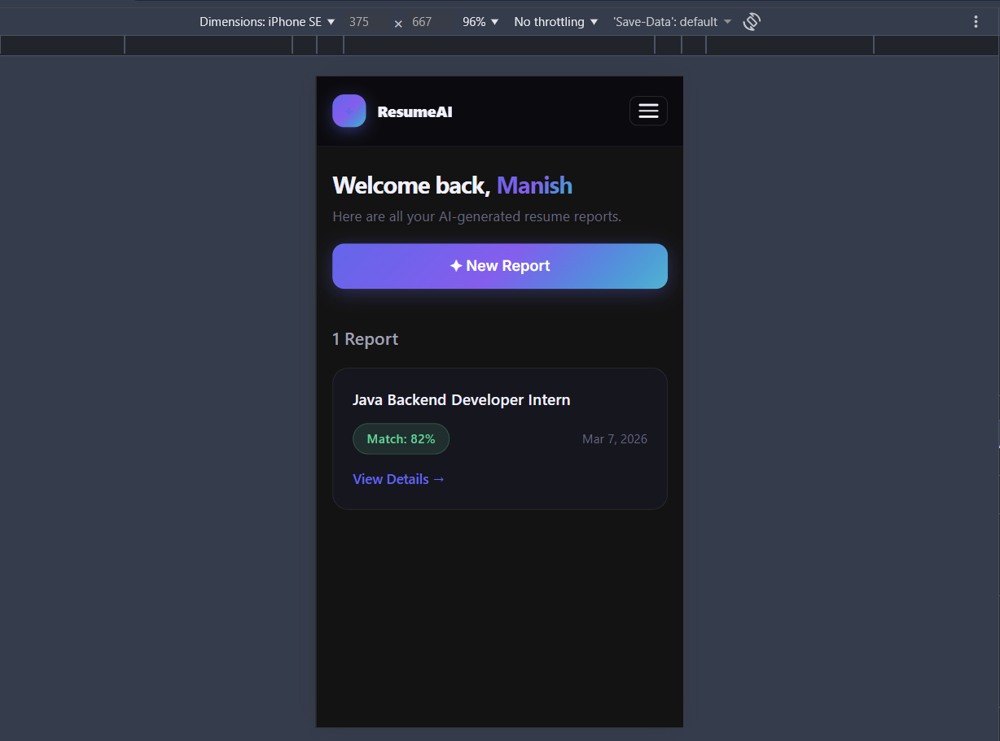
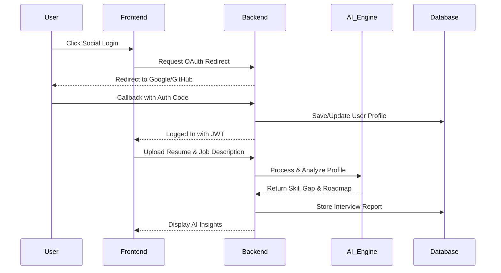

# 📄 Resume Analyzer - AI-Powered Career Intelligence


**Resume Analyzer** is a state-of-the-art career optimization tool that leverages GenAI to transform how job seekers prepare for their dream roles. By analyzing resumes against target job descriptions, it identifies skill gaps, generates tailor-made interview questions, and provides a structured roadmap for success.

---

## 🚀 Key Features

- **🔐 Secure Social Authentication**: Seamless login integration with Google and GitHub using OAuth2 and JWT session management.
- **🧠 AI Resume Analysis**: Powered by Google Gemini & OpenRouter to provide deep insights into your resume's strengths and weaknesses.
- **📊 Detailed Interview Reports**:
    - **Technical Questions**: Generated based on your specific tech stack.
    - **Behavioral Questions**: Tailored to your past experience.
    - **Skill Gap Analysis**: Identification of missing keywords and technologies.
    - **Roadmap**: A step-by-step guide to becoming the perfect candidate.
- **📄 PDF Export & Emailing**: Generate professional interview reports as PDFs and have them delivered directly to your inbox via Brevo SMTP integration.
- **📱 Premium Responsive UI**: A modern, dark-themed dashboard built with glassmorphism aesthetics and smooth transitions.

---

## 🛠️ Tech Stack

### Backend (Spring Boot)
- **Spring Security**: OAuth2 Social Login and JWT Authentication.
- **JPA & Hibernate**: Robust data persistence with PostgreSQL.
- **AI Integration**: RestClient for Gemini API and OpenRouter logic.
- **Email Service**: Brevo (formerly Sendinblue) SMTP for PDF delivery.
- **PDF Engine**: OpenHTMLtoPDF for high-fidelity report generation.

### Frontend (React)
- **Vite**: Ultra-fast frontend build tool.
- **React Router 6**: For smooth SPA navigation.
- **SCSS**: Advanced styling with a modular architecture.
- **Context API**: Global state management for user sessions.

---

## 📸 Screenshots

*(Add your actual application screenshots here for a stunning look!)*

|         Login Page          | AI Dashboard |
|:-----------------------------:| :---: |
|  |  |

| Analysis Report | Mobile View |
| :---: | :---: |
|  |  |

---

## 🏗️ Architecture

The application follows a secure Social Login flow coupled with a background AI processing pipeline.



---

## ⚙️ Installation & Setup

### Prerequisites
- Java 17+
- Node.js 18+
- PostgreSQL Database
- Google/GitHub OAuth Credentials

### 1. External API Keys
Create a `.env` file in the `backend/` directory:
```env
# Database
DB_URL=jdbc:postgresql://localhost:5432/resume_db
DB_USERNAME=your_username
DB_PASSWORD=your_password

# OAuth2 Secrets
GOOGLE_CLIENT_ID=...
GOOGLE_CLIENT_SECRET=...
GITHUB_CLIENT_ID=...
GITHUB_CLIENT_SECRET=...

# AI Keys
GEMINI_API_KEY=...
OPENROUTER_API_KEY=...

# Email (Brevo)
MAIL_USERNAME=your_email
MAIL_PASSWORD=your_api_key
```

### 2. Run Backend
```bash
cd backend
mvn clean install
mvn spring-boot:run
```

### 3. Run Frontend
```bash
cd frontend
npm install
npm run dev
```

---

## 🛡️ Important: Clock Synchronization
If you experience `JwtValidationException` errors during Google Login, ensure your system clock is synchronized:
1. Go to Windows **Date & Time settings**.
2. Click **Sync Now** to ensure your local time matches Google's global servers.

---
Created with ❤️ by [Manish](https://github.com/Manish0085)
